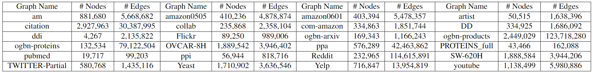
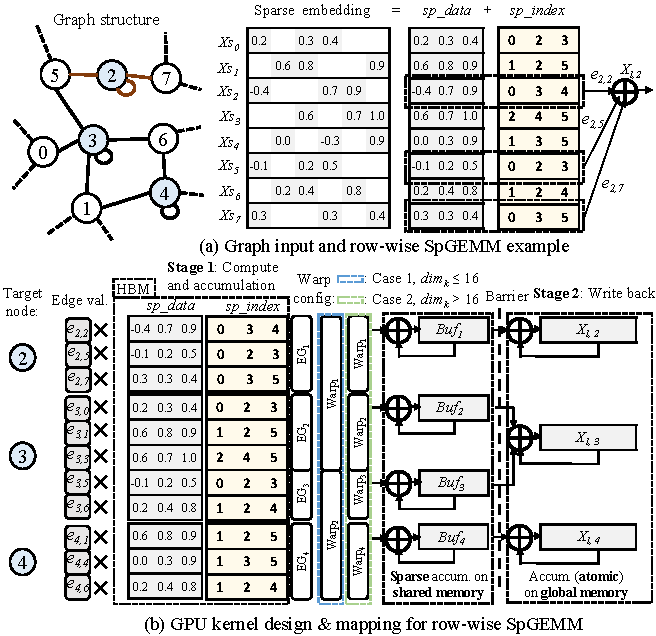
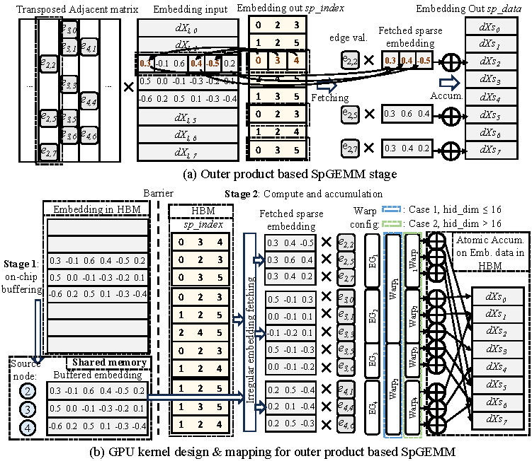
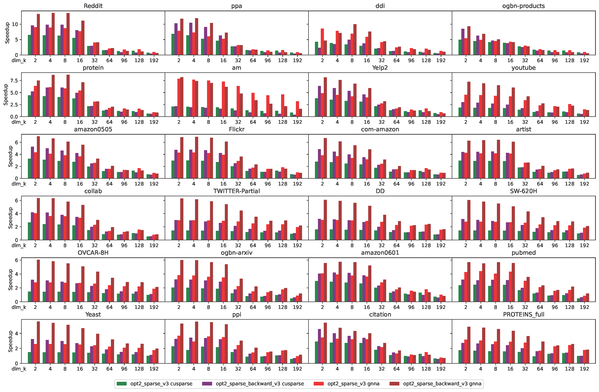

# MaxK-GNN

Official Implementation of "MaxK-GNN: Towards Theoretical Speed Limits for Accelerating Graph Neural Networks Training"

## Abstract
The following kernels are benchmarked here:

`spmm_maxk.cu`  The implementation of our MaxK-GNN's forward SpGEMM kernel design.

`spmm_maxk_backward.cu`  The implementation of our MaxK-GNN's backward SSpMM kernel design.

`spmm_gnna.cu`  The SPMM kernel of [GNNAdvisor](https://github.com/YukeWang96/GNNAdvisor_OSDI21).

`spmm_cusparse.cu`  The [cuSPARSE](https://docs.nvidia.com/cuda/cusparse/index.html) SPMM functionality.

## Get started

### Prerequisites
Nvidia GPU with compute capability greater than or equal to 8.6

CUDA toolkit 12.0

GCC version 6.3 or later (to support the C++17 standard)

cmake version 3.5

For the python scripts, numpy and scipy are required


### Download dataset
Our benchmark dataset contains 24 graphs:


It can be downloaded from https://drive.google.com/file/d/1rSrxfZcdhjlMsJNXwUUWCaqytX4aUHWc/view?usp=sharing , 
or you can use the following command:
```
wget --load-cookies /tmp/cookies.txt "https://docs.google.com/uc?export=download&confirm=$(wget --quiet --save-cookies /tmp/cookies.txt --keep-session-cookies --no-check-certificate 'https://docs.google.com/uc?export=download&id=1rSrxfZcdhjlMsJNXwUUWCaqytX4aUHWc' -O- | sed -rn 's/.*confirm=([0-9A-Za-z_]+).*/\1\n/p')&id=1rSrxfZcdhjlMsJNXwUUWCaqytX4aUHWc" -O maxk_graphs.tar.gz && rm -rf /tmp/cookies.txt
```
Place the downloaded file in the project directory, then unzip it (and rename it).
```
tar xzvf maxk_graphs.tar.gz
mv maxk_graphs graphs
```
Generate the meta-data for MaxK-GNN's kernels.
```
python generate_meta.py
```

### Compilation
```
mkdir build
cd build
cmake ..
make -j10
```
After compilation, an executable file named `maxk_kernel_test` is generated.

## Benchmarking
Benchmark MaxK-GNN's kernels on a specified graph:
```
./maxk_kernel_test reddit.dgl
```
If no parameters are attached, 
it will execute a traversal-style benchmark for all graphs:
```
./maxk_kernel_test
```
You can use the tee command to save command-line output to a file: 
```
./maxk_kernel_test | tee result.txt
```

## Kernel design of MaxK-GNN

The SPMM kernel of Accel-GCN incorporates block-level partitioning and a combined warp strategy for traversing the right-hand matrix column dimension. 
This approach exploits multi-level memory efficiency, memory coalescing, and alignment, which further optimizes execution efficiency.




### Speedups over other SPMM kernels

On average, evaluation of Accel-GCN across 18 benchmark graphs demonstrates that Accel-GCN surpasses cuSPARSE, GNNAdvisor, and graph-BLAST by 17.3%, 86.3%, and 193.5% respectively.


